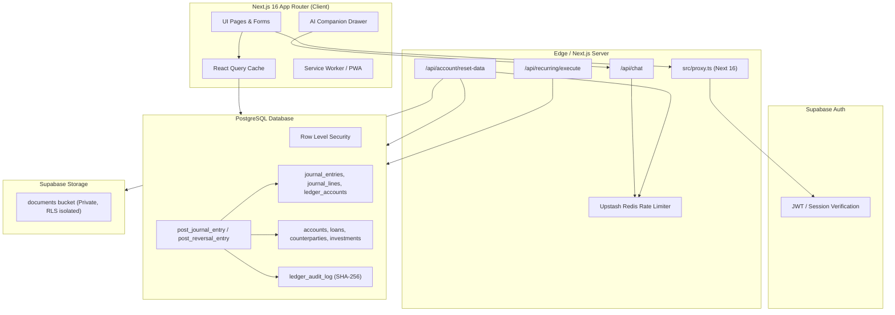

# NISFLOW FINANCE — SYSTEM ARCHITECTURE AUDIT

**Date:** 2026-08-20  
**Auditor:** Principal Software Architect  
**Scope:** Application Boundaries, Double-Entry Foundation, AI Capability Engine, Migration Pipeline, and State Management.

---

## 1. Architectural Architecture Diagram

---

## 2. Structural Layer Analysis

### 2.1 Next.js 16 Proxy Layer
- Conforms to Next.js 16 conventions where `middleware.ts` was replaced by `src/proxy.ts` exporting `async function proxy(request)`.
- Correctly dispatches to `@supabase/ssr` to refresh cookies and guard dashboard routes.

### 2.2 Double-Entry Ledger Layer
- Authoritative financial core. All mutations execute via stored procedures (`post_journal_entry`).
- Immutability enforced by database triggers.
- Reversals execute symmetrically, ensuring zero-sum accounting.

### 2.3 AI Capability Layer
- Follows the principle: **"Broad Authority, Narrow Assumptions"**.
- Capability Registry (`src/lib/ai/capabilities.ts`) defines authority levels L0 through L4.
- Entity Resolution (`src/lib/ai/entity-resolution.ts`) prevents entity hallucinations and cross-tenant leakage.

### 2.4 State Management Layer
- Server-state synchronized via TanStack React Query with 5-minute `staleTime`.
- Client-side persistence cleanly registered in `src/lib/security/client-storage-registry.ts`.
- Tenant-isolated data reset completely cleanses IndexedDB, React Query cache, and localStorage namespaces without dropping auth credentials.

---

## 3. Architecture Strengths & Technical Debt

### 3.1 Architectural Strengths
1. Authoritative double-entry ledger in PostgreSQL prevents balance drift.
2. Tenant isolation enforced simultaneously at RLS, RPC, and AI context layers.
3. Cryptographic SHA-256 tamper-evident ledger audit trail.
4. Comprehensive multi-phase destructive data reset with post-reset verification.

### 3.2 Technical Debt Items
1. Inconsistent column consumption (`balance` vs `current_balance`) in some read models.
2. Stale table references in AI context (`holdings` vs `investments`).
3. Ad-hoc dropdowns and dialogs that should be consolidated into the unified design system.
