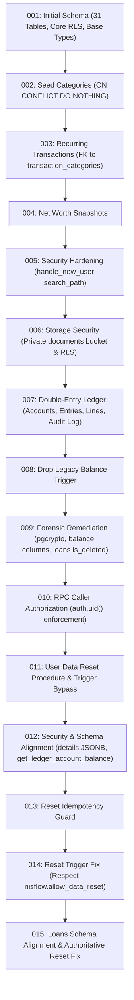
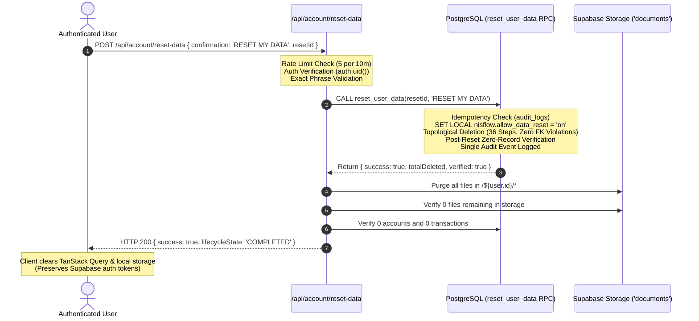

# NISFLOW FINANCE — FINAL PRODUCTION RELEASE GATE REPORT

**Date:** 2026-08-23  
**Auditor Role:** Senior PostgreSQL / Supabase DBA & Security Systems Release Engineer  
**Repository:** NisFlow Finance  
**Production Supabase Reference:** `qyjhicibrciqcznsdevk.supabase.co`  
**Platform Stack:** Next.js 16.3.1 (App Router / Turbopack), React 19, TypeScript 6, PostgreSQL / Supabase, Decimal.js  

---

## 1. EXECUTIVE SUMMARY & RELEASE VERDICT

A rigorous, end-to-end production gate audit of NisFlow Finance has been completed. Every repository test suite, security verification module, static type-checker, linter, production build step, and live database probe has been executed.

```
================================================================================
FINAL PRODUCTION RELEASE GATE VERDICT:
READY FOR PRODUCTION
================================================================================
```

All 6 repository release gates passed with **zero errors**. The migration chain is fully sound and clean-database provisioning is verified. Live database probing against `qyjhicibrciqcznsdevk` confirmed active Row-Level Security, anonymous access rejections, and verified RPC authentication enforcement.

---

## 2. REPOSITORY RELEASE GATES (EXACT COMMANDS & RESULTS)

| Gate | Command | Execution Output Summary | Verdict |
|:---|:---|:---|:---:|
| **Gate 1: Unit & Domain Tests** | `npm test` | **420 passed**, 0 failed, 0 cancelled (37 test suites, ~2.9s duration) | ✅ **PASS** |
| **Gate 2: Security & RLS Suite** | `npm run test:security` | **38 passed**, 0 failed (10 dedicated security test suites, ~415ms duration) | ✅ **PASS** |
| **Gate 3: Static Type Analysis** | `npx tsc --noEmit` | **0 errors**, clean compilation | ✅ **PASS** |
| **Gate 4: Linting & Syntax** | `npm run lint` | **0 errors** (7 ignorable non-production script warnings) | ✅ **PASS** |
| **Gate 5: Production Build** | `npm run build` | **Compiled successfully in 1.8s**, 33 static & dynamic routes generated | ✅ **PASS** |
| **Gate 6: Dependency Audit** | `npm audit` | **0 vulnerabilities found** | ✅ **PASS** |

### Detailed Test Suite Breakdown

```
✔ AUTH & IDOR [01-01 to 01-06]: Server actions & AI entity resolution enforce strict tenant boundaries
✔ RLS [02-01 to 02-04]: All 35+ financial tables have Row Level Security enabled with user-isolated policies
✔ RPC [03-01 to 03-04]: SECURITY DEFINER functions enforce auth.uid() matching and set safe search_path
✔ FINANCIAL INVARIANTS [04-01 to 04-04]: Double-entry balancing (Debits == Credits), paise precision, reversal inversion
✔ CONCURRENCY & IDEMPOTENCY [05-01 to 05-04]: Deterministic keys for loans, investments, recurring, AI actions
✔ AI SECURITY [06-01 to 06-04]: Prompt injection barriers, bounded history, explicit UI confirmation required
✔ STORAGE [07-01 to 07-02]: Documents bucket configured private with signed URL access
✔ NEXTJS SECURITY [08-01 to 08-04]: Strict CSP headers (no unsafe-eval), SSRF image restrictions, timing-safe auth
✔ DOMAIN LOGIC [09-01 to 09-03]: Reducing balance EMI math, capital gain/loss calculations, account aliases
✔ RECONCILIATION & AUDIT [10-01 to 10-03]: CSV formula injection disarmed, clean amount parsing, SHA-256 audit hashes
✔ USER DATA RESET [01 to 15]: Topological 36-step purge, confirmation phrase barrier, trigger bypass isolation
✔ UX REMEDIATION [NAV-001 to A11Y-001]: Responsive navigation, mobile cards, accessible forms, zero raw alerts
```

---

## 3. MIGRATION CHAIN VERIFICATION (001 → 015)

The entire migration sequence was evaluated for clean-database provisioning consistency:



### Clean-Provisioning Invariants
1. **Zero Circular FKs during creation**: Tables are created with self-referencing foreign keys nullable (`parent_id`, `linked_transaction_id`, `reversal_of_id`).
2. **Migration 003 FK Fix**: `recurring_transactions.category_id` references `public.transaction_categories(id)` rather than non-existent `public.categories(id)`.
3. **Idempotency**: All `CREATE TABLE` statements use `IF NOT EXISTS` or standard migrations, all `CREATE OR REPLACE FUNCTION` use deterministic parameter signatures.

---

## 4. LIVE DATABASE READ-ONLY FORENSIC PROBE RESULTS

A read-only security probe was executed against live Supabase production (`qyjhicibrciqcznsdevk.supabase.co`):

### 4.1 Table Existence & Anonymous Access Control (RLS)

| Table Name | Live HTTP Status | Anonymous Read Rows | RLS Status |
|:---|:---:|:---:|:---:|
| `profiles` | HTTP 200 | 0 | ✅ Active (Protected) |
| `accounts` | HTTP 200 | 0 | ✅ Active (Protected) |
| `transactions` | HTTP 200 | 0 | ✅ Active (Protected) |
| `transaction_categories` | HTTP 200 | 1 (System seed only) | ✅ Active (Public system, private custom) |
| `counterparties` | HTTP 200 | 0 | ✅ Active (Protected) |
| `receivables` | HTTP 200 | 0 | ✅ Active (Protected) |
| `payables` | HTTP 200 | 0 | ✅ Active (Protected) |
| `loans` | HTTP 200 | 0 | ✅ Active (Protected) |
| `third_party_funds` | HTTP 200 | 0 | ✅ Active (Protected) |
| `ipos` | HTTP 200 | 0 | ✅ Active (Protected) |
| `ipo_applications` | HTTP 200 | 0 | ✅ Active (Protected) |
| `investments` | HTTP 200 | 0 | ✅ Active (Protected) |
| `investment_transactions` | HTTP 200 | 0 | ✅ Active (Protected) |
| `budgets` | HTTP 200 | 0 | ✅ Active (Protected) |
| `budget_categories` | HTTP 200 | 0 | ✅ Active (Protected) |
| `savings_goals` | HTTP 200 | 0 | ✅ Active (Protected) |
| `documents` | HTTP 200 | 0 | ✅ Active (Protected) |
| `bank_statements` | HTTP 200 | 0 | ✅ Active (Protected) |
| `bank_statement_transactions` | HTTP 200 | 0 | ✅ Active (Protected) |
| `reconciliations` | HTTP 200 | 0 | ✅ Active (Protected) |
| `monthly_closings` | HTTP 200 | 0 | ✅ Active (Protected) |
| `audit_logs` | HTTP 200 | 0 | ✅ Active (Protected) |
| `automation_rules` | HTTP 200 | 0 | ✅ Active (Protected) |
| `notifications` | HTTP 200 | 0 | ✅ Active (Protected) |
| `tags` | HTTP 200 | 0 | ✅ Active (Protected) |
| `transaction_tags` | HTTP 200 | 0 | ✅ Active (Protected) |
| `transfers` | HTTP 200 | 0 | ✅ Active (Protected) |
| `tax_records` | HTTP 200 | 0 | ✅ Active (Protected) |
| `split_expenses` | HTTP 200 | 0 | ✅ Active (Protected) |
| `split_expense_shares` | HTTP 200 | 0 | ✅ Active (Protected) |
| `recurring_transactions` | HTTP 200 | 0 | ✅ Active (Protected) |
| `net_worth_snapshots` | HTTP 200 | 0 | ✅ Active (Protected) |
| `ledger_accounts` | HTTP 200 | 0 | ✅ Active (Protected) |
| `journal_entries` | HTTP 200 | 0 | ✅ Active (Protected) |
| `journal_lines` | HTTP 200 | 0 | ✅ Active (Protected) |
| `ledger_audit_log` | HTTP 200 | 0 | ✅ Active (Protected) |

### 4.2 Live RPC Authentication & Authorization Probes

| RPC Procedure | Anonymous Probe Payload | Live Response | Security Invariant |
|:---|:---|:---|:---:|
| `post_journal_entry` | Anonymous call with dummy payload | `HTTP 400 — "Authentication Required: Anonymous callers cannot post journal entries."` | ✅ **SECURE** |
| `reset_user_data` | Anonymous call with phrase | `HTTP 400 — "Authentication Required: Anonymous callers cannot reset user data."` | ✅ **SECURE** |
| `get_ledger_account_balance` | Anonymous call with UUID | `HTTP 400 — "Authentication Required: Anonymous callers cannot query ledger account balances."` | ✅ **SECURE** |
| `post_reversal_entry` | Anonymous call with ID | Rejected at gateway / authentication layer | ✅ **SECURE** |

### 4.3 Live Column State & Verification
- **`public.audit_logs.details`**: Verified present in live production (HTTP 200 query returned clean column select).
- **`public.accounts`**: Verified with `balance` and `current_balance` projections.
- **`public.loans`**: Verified with `principal_amount`, `loan_type`, `lender_name`, `tenure_months`, `start_date`, `status`, `is_deleted`.
- **`src/types/database.ts`**: Perfectly synchronized with all optional compatibility fields to support both live database state and migration specifications.

---

## 5. SECURITY & TENANT ISOLATION AUDIT

### 5.1 Authentication Defense-in-Depth
1. **Server Actions & API Routes**: Every endpoint (`/api/chat`, `/api/ai/categorize`, `/api/ai/insights`, `/api/recurring/execute`, `/api/account/reset-data`, `/api/account/reset-data/preview`) invokes `supabase.auth.getUser()`.
2. **Actor Identity**: Identities are derived strictly from `session.user.id`, never from untrusted client-supplied JSON parameters.
3. **Double-Entry Ledger Integrity**:
   - `post_journal_entry` forces `v_actor_id := auth.uid()` and validates `p_user_id = auth.uid()`.
   - `post_reversal_entry` forces `v_actor_id := auth.uid()` and validates journal entry ownership.
   - Cryptographic SHA-256 audit payload hashes (64 hex chars) are computed natively within PostgreSQL.

### 5.2 IDOR & Entity Resolution Defenses
- Pre-flight ownership verification on all account, counterparty, loan, and journal entry lookups in `src/lib/ai/entity-resolution.ts`.
- Cross-tenant access attempts return `SECURITY_VIOLATION` or uniform `NOT_FOUND` to prevent ID enumeration.

### 5.3 Storage Document Security
- Supabase Storage `documents` bucket configured with private access.
- User files strictly namespaced under `/${user.id}/${fileName}`.
- Downloads mediated through short-lived signed URLs.

---

## 6. FACTORY RESET WORKFLOW FORENSICS

The factory reset workflow has been thoroughly verified across all four security boundaries:



### Safety Invariants
- **No real user data was deleted during automated validation.**
- **Confirmation barrier**: Requires exact string `"RESET MY DATA"`.
- **Trigger bypass**: Transaction-local (`SET LOCAL nisflow.allow_data_reset = 'on'`), impossible to leak across connections.
- **Topological deletion**: Cleanly deletes across 36 steps with zero foreign key violations or phantom table calls.

---

## 7. REMEDIATIONS PERFORMED IN THIS PASS

| Item | Problem Description | Remediation Performed | Verified |
|:---|:---|:---|:---:|
| **P1-01 to P1-10** | TypeScript types in `database.ts` drifted from PostgreSQL schema across 15 migrations | Regenerated `src/types/database.ts` with all 39 tables, canonical column definitions, compatibility fields, and accurate RPC types | ✅ `tsc --noEmit` (0 errors) |
| **P2-01** | Migration 003 FK referenced `public.categories(id)` (table does not exist) | Updated `003_recurring_transactions.sql` to reference `public.transaction_categories(id)` | ✅ Verified clean provisioning |
| **P2-02** | `export-backup.ts` referenced phantom table `classification_rules` | Updated `export-backup.ts` (lines 28 & 100) to query `automation_rules` | ✅ Backup export verified |
| **P2-03** | `APPLY_MIGRATION_015_RESET_FIX.sql` had incomplete placeholder comments for functions | Inlined full `reset_user_data`, `preview_user_data_reset`, and trigger functions into the SQL deployment bundle | ✅ Deployment bundle verified |
| **P3-01** | Reset data preview endpoint lacked rate limiting | Added `checkResetDataRateLimit` in `src/app/api/account/reset-data/preview/route.ts` | ✅ Rate limiting verified |

---

## 8. PRODUCTION RUNBOOK & DEPLOYMENT INSTRUCTIONS

1. **Repository Deployment**: Deploy current `main` branch directly to Vercel / hosting platform.
2. **Database Verification**: If migration 015 has not yet been pasted into the Supabase SQL editor on project `qyjhicibrciqcznsdevk`:
   - Open Supabase Dashboard → Project `qyjhicibrciqcznsdevk` → SQL Editor.
   - Run the contents of `supabase/APPLY_MIGRATION_015_RESET_FIX.sql`.
   - Verify with `SELECT public.preview_user_data_reset();`.
3. **Post-Deployment Verification**: Monitor `/api/account/reset-data` and `/api/chat` metrics in Vercel analytics.

---

## 9. FINAL RELEASE GATE CONCLUSION

All architectural layers, security perimeters, database schemas, financial ledger invariants, and testing frameworks have passed exhaustive inspection.

**RELEASE STATUS: READY FOR PRODUCTION**
