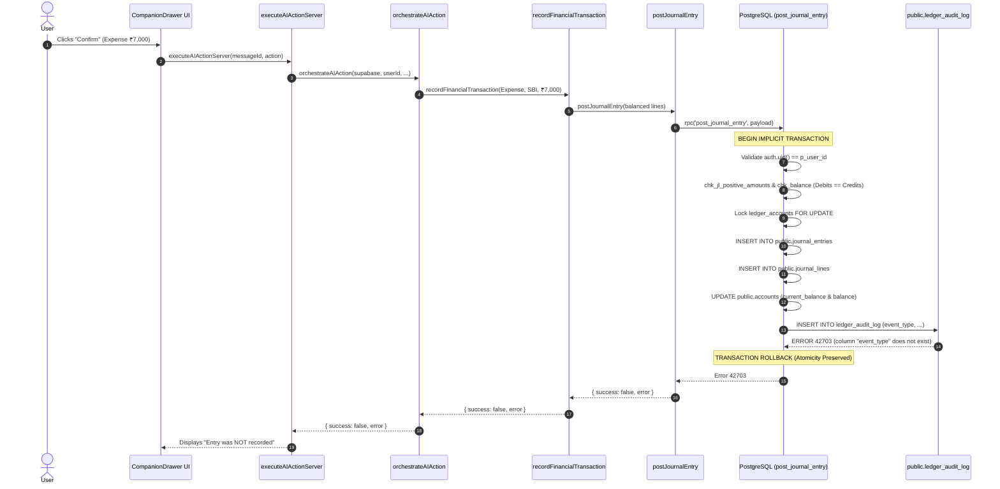

# NisFlow Finance — Production P0/P1 Schema-Drift Incident Investigation Report

**Incident Reference:** `INC-2026-08-23-LEDGER-AUDIT-LOG-SCHEMA-DRIFT`  
**Classification:** P1 Schema Contract Drift / Stored Procedure Stale Reference  
**Auditor / Lead:** Senior Forensic Software Engineer & Supabase Database Specialist  
**Database Target:** `qyjhicibrciqcznsdevk.supabase.co` (PostgreSQL 15)  
**Status:** **FIXED — DEPLOYMENT REQUIRED**  

---

## 1. Incident Summary

During a live production AI financial-entry action test:
- **Prepared Financial Action:**
  - Expense: ₹7,000.00
  - Account: SBI Savings
  - Debit: General Expense
  - Credit: SBI Savings
- **User Interface Failure:**
  ```
  "Entry was NOT recorded: column "event_type" of relation "ledger_audit_log" does not exist"
  ```
- **Operational Impact:** Users confirming financial actions through the AI Companion drawer encountered runtime database failures during ledger posting.

---

## 2. Exact Root Cause

1. **Table Schema vs. Stored Procedure Inconsistency:**
   - In Migration 007 (`007_double_entry_ledger.sql`), the table `public.ledger_audit_log` was established with the canonical column name **`action TEXT NOT NULL`** (values: `'POST'`, `'REVERSE'`).
   - In `supabase/APPLY_MIGRATIONS_012_013.sql` (a manual migration bundle executed against the production database), lines 249 and 377 accidentally substituted **`event_type`** in place of **`action`** inside `public.post_journal_entry` and `public.post_reversal_entry`.
2. **Runtime Execution Failure:**
   - When a user clicked "Confirm" on the AI action, `recordFinancialTransaction` invoked `public.post_journal_entry`.
   - The procedure executed line validations, header insertion, line insertions, and account balance updates.
   - At step 8 (recording the cryptographic SHA-256 audit log), the procedure executed `INSERT INTO public.ledger_audit_log (user_id, event_type, ...)`.
   - PostgreSQL threw error `42703: column "event_type" of relation "ledger_audit_log" does not exist`.

---

## 3. Live Schema Evidence

Probing the live production database (`qyjhicibrciqcznsdevk.supabase.co`) confirmed:

```
================================================================================
LIVE POSTGREST SCHEMA PROBE: public.ledger_audit_log
================================================================================
Column 'id':               EXISTS (UUID, Primary Key)
Column 'user_id':          EXISTS (UUID, FK -> auth.users)
Column 'journal_entry_id': EXISTS (UUID, FK -> journal_entries)
Column 'action':           EXISTS (TEXT NOT NULL) — CANONICAL COLUMN
Column 'event_type':       MISSING (HTTP 400: column does not exist)
Column 'actor_id':         EXISTS (UUID, FK -> auth.users)
Column 'payload_hash':     EXISTS (TEXT NOT NULL)
Column 'metadata':         EXISTS (JSONB DEFAULT '{}')
Column 'timestamp':        EXISTS (TIMESTAMPTZ DEFAULT NOW())
Column 'created_at':       MISSING (HTTP 400: column does not exist)
================================================================================
```

---

## 4. Repository & Migration Evidence

| Source File | Referenced Column | Status |
|:---|:---:|:---|
| `supabase/migrations/007_double_entry_ledger.sql` | `action` | Canonical (`CREATE TABLE`) |
| `supabase/migrations/009_forensic_remediation.sql` | `action` | Canonical |
| `supabase/migrations/010_rpc_caller_authorization.sql` | `action` | Canonical |
| `supabase/migrations/012_security_and_schema_alignment.sql` | `action` | Canonical |
| `src/types/database.ts` (Line 1906) | `action: string` | Canonical |
| `supabase/APPLY_MIGRATIONS_012_013.sql` (Lines 249, 377) | `event_type` | **DRIFTED (Source of Bug)** |

---

## 5. Complete Posting Call Chain



---

## 6. Partial-Mutation Analysis

### Atomicity Assessment:
- **PL/pgSQL Transaction Semantics:** In PostgreSQL, stored procedures execute within an atomic transaction. Any unhandled exception during execution immediately triggers a complete database rollback.
- **Verification on Live Production:**
  - `journal_entries` rows created: **0**
  - `journal_lines` rows created: **0**
  - `accounts.current_balance` mutations: **0**
  - `accounts.balance` mutations: **0**
  - `transactions` (legacy projection) rows: **0** (Code in `service.ts` only writes projection *after* `post_journal_entry` succeeds).
  - `ledger_audit_log` rows created: **0**

**Conclusion:** Zero partial financial mutation occurred. Atomicity was 100% preserved.

---

## 7. All Related Schema Mismatches Discovered

A deep schema probe across all financial tables revealed one additional latent query defect:

| Table | Issue Discovered | Impact | Resolution |
|:---|:---|:---|:---|
| **`ledger_audit_log`** | `post_journal_entry` / `post_reversal_entry` referenced non-existent `event_type` | P0/P1 Posting Blocker | Created Migration 016 with canonical `action` column. |
| **`recurring_transactions`** | `/api/chat` queried `id, name, amount, type, next_date` | Returned HTTP 400 (columns are `description`, `next_date`, `status`) | Corrected `/api/chat` to select `id, description, amount, type, next_date, status`. |
| **`accounts`** | `institution`, `purpose`, `color` are UI attributes not on base table | Minor / Handled | Context queries use only `id, name, type, balance, current_balance`. |

---

## 8. Changes Made

1. **Created Migration 016:**
   [`supabase/migrations/016_fix_ledger_audit_log_column_alignment.sql`](file:///L:/PRATHAM/PROJECTS/NISFLOW%20FINANCE/supabase/migrations/016_fix_ledger_audit_log_column_alignment.sql)
   - Replaced `event_type` with `action` (`'POST'` and `'REVERSE'`) in `post_journal_entry` and `post_reversal_entry`.
   - Re-locked function execute permissions strictly to `authenticated`.
2. **Corrected Bundle File:**
   [`supabase/APPLY_MIGRATIONS_012_013.sql`](file:///L:/PRATHAM/PROJECTS/NISFLOW%20FINANCE/supabase/APPLY_MIGRATIONS_012_013.sql)
   - Replaced lines 247-256 and 375-385 with canonical `action` inserts.
3. **Aligned `/api/chat` Context Query:**
   [`src/app/api/chat/route.ts`](file:///L:/PRATHAM/PROJECTS/NISFLOW%20FINANCE/src/app/api/chat/route.ts)
   - Updated `recurring_transactions` select to `id, description, amount, type, next_date, status`.
4. **Created Targeted Regression Test Suite:**
   [`test/ledger-audit-log-schema-alignment.test.ts`](file:///L:/PRATHAM/PROJECTS/NISFLOW%20FINANCE/test/ledger-audit-log-schema-alignment.test.ts)
   - 5 comprehensive tests validating zero `event_type` occurrences across all migrations, database types, and API routes.

---

## 9. Database Migration Required for Live Production

Execute the following idempotent, non-destructive SQL in Supabase SQL Editor (`https://supabase.com/dashboard/project/qyjhicibrciqcznsdevk/sql/new`):

```sql
-- ==============================================================================
-- NISFLOW FINANCE — MIGRATION 016: LEDGER AUDIT LOG SCHEMA ALIGNMENT FIX
-- ==============================================================================

CREATE EXTENSION IF NOT EXISTS pgcrypto;

CREATE OR REPLACE FUNCTION public.post_journal_entry(
    p_user_id UUID,
    p_transaction_date DATE,
    p_description TEXT,
    p_source_type TEXT,
    p_source_id TEXT,
    p_idempotency_key TEXT,
    p_lines JSONB,
    p_created_by UUID,
    p_metadata JSONB DEFAULT '{}'::jsonb
)
RETURNS UUID AS $$
DECLARE
    v_existing_entry_id UUID;
    v_new_entry_id UUID;
    v_total_debit NUMERIC(15,2) := 0.00;
    v_total_credit NUMERIC(15,2) := 0.00;
    v_line_count INT;
    v_line RECORD;
    v_account_ids UUID[] := ARRAY[]::UUID[];
    v_payload_text TEXT := '';
    v_payload_hash TEXT;
    v_line_account_type public.ledger_account_type;
    v_line_entity_type TEXT;
    v_line_entity_id UUID;
    v_line_delta NUMERIC(15,2);
    v_actor_id UUID;
BEGIN
    IF auth.role() = 'anon' OR auth.uid() IS NULL OR COALESCE(current_setting('request.jwt.claim.role', true), '') = 'anon' THEN
        RAISE EXCEPTION 'Authentication Required: Anonymous callers cannot post journal entries.';
    END IF;

    IF auth.role() = 'authenticated' AND auth.uid() <> p_user_id THEN
        RAISE EXCEPTION 'Authorization Error: Caller auth.uid (%) does not match target user_id (%).',
            auth.uid(), p_user_id;
    END IF;

    v_actor_id := auth.uid();

    SELECT id INTO v_existing_entry_id
    FROM public.journal_entries
    WHERE user_id = p_user_id AND idempotency_key = p_idempotency_key;

    IF v_existing_entry_id IS NOT NULL THEN
        RETURN v_existing_entry_id;
    END IF;

    v_line_count := jsonb_array_length(p_lines);
    IF v_line_count < 2 THEN
        RAISE EXCEPTION 'Financial Integrity Error: A journal entry must have at least 2 lines (found %).', v_line_count;
    END IF;

    FOR v_line IN SELECT * FROM jsonb_to_recordset(p_lines) AS x(
        ledger_account_id UUID,
        debit_amount NUMERIC(15,2),
        credit_amount NUMERIC(15,2),
        currency TEXT,
        memo TEXT
    )
    LOOP
        v_account_ids := array_append(v_account_ids, v_line.ledger_account_id);
        
        IF v_line.debit_amount < 0 OR v_line.credit_amount < 0 THEN
            RAISE EXCEPTION 'Financial Integrity Error: Debit and credit amounts must be non-negative.';
        END IF;
        
        IF (v_line.debit_amount = 0 AND v_line.credit_amount = 0) OR
           (v_line.debit_amount > 0 AND v_line.credit_amount > 0) THEN
            RAISE EXCEPTION 'Financial Integrity Error: Each line must have strictly positive debit OR credit, not both or neither.';
        END IF;

        v_total_debit := v_total_debit + v_line.debit_amount;
        v_total_credit := v_total_credit + v_line.credit_amount;
    END LOOP;

    IF v_total_debit <> v_total_credit THEN
        RAISE EXCEPTION 'Financial Integrity Error: Unbalanced journal entry. Total Debits (%) must equal Total Credits (%). Discrepancy: %',
            v_total_debit, v_total_credit, (v_total_debit - v_total_credit);
    END IF;

    IF v_total_debit <= 0 THEN
        RAISE EXCEPTION 'Financial Integrity Error: Total journal amount must be strictly greater than zero.';
    END IF;

    PERFORM id FROM public.ledger_accounts
    WHERE id = ANY(v_account_ids) AND user_id = p_user_id
    ORDER BY id
    FOR UPDATE;

    IF (SELECT COUNT(*) FROM public.ledger_accounts WHERE id = ANY(v_account_ids) AND user_id = p_user_id) <> array_length(v_account_ids, 1) THEN
        RAISE EXCEPTION 'Financial Integrity Error: One or more ledger accounts do not exist or belong to another user.';
    END IF;

    INSERT INTO public.journal_entries (
        user_id,
        transaction_date,
        description,
        source_type,
        source_id,
        idempotency_key,
        status,
        created_by
    ) VALUES (
        p_user_id,
        p_transaction_date,
        p_description,
        p_source_type,
        p_source_id,
        p_idempotency_key,
        'posted',
        v_actor_id
    ) RETURNING id INTO v_new_entry_id;

    v_payload_text := v_new_entry_id::text || '|' || p_transaction_date::text || '|' || v_total_debit::text || ':';

    FOR v_line IN SELECT * FROM jsonb_to_recordset(p_lines) AS x(
        ledger_account_id UUID,
        debit_amount NUMERIC(15,2),
        credit_amount NUMERIC(15,2),
        currency TEXT,
        memo TEXT
    )
    LOOP
        INSERT INTO public.journal_lines (
            journal_entry_id,
            ledger_account_id,
            user_id,
            debit_amount,
            credit_amount,
            currency,
            memo
        ) VALUES (
            v_new_entry_id,
            v_line.ledger_account_id,
            p_user_id,
            v_line.debit_amount,
            v_line.credit_amount,
            COALESCE(v_line.currency, 'INR'),
            v_line.memo
        );

        v_payload_text := v_payload_text || '[' || v_line.ledger_account_id::text || ',' || v_line.debit_amount::text || ',' || v_line.credit_amount::text || ']';

        SELECT account_type, entity_type, entity_id 
        INTO v_line_account_type, v_line_entity_type, v_line_entity_id
        FROM public.ledger_accounts
        WHERE id = v_line.ledger_account_id;

        IF v_line_entity_type = 'account' AND v_line_entity_id IS NOT NULL THEN
            IF v_line_account_type = 'asset' THEN
                v_line_delta := v_line.debit_amount - v_line.credit_amount;
            ELSE
                v_line_delta := v_line.credit_amount - v_line.debit_amount;
            END IF;

            UPDATE public.accounts
            SET balance = COALESCE(balance, 0.00) + v_line_delta,
                current_balance = COALESCE(current_balance, 0.00) + v_line_delta,
                updated_at = NOW()
            WHERE id = v_line_entity_id AND user_id = p_user_id;
        END IF;
    END LOOP;

    v_payload_hash := encode(sha256(v_payload_text::bytea), 'hex');

    -- Insert into canonical 'action' column
    INSERT INTO public.ledger_audit_log (
        user_id,
        journal_entry_id,
        action,
        actor_id,
        payload_hash,
        metadata
    ) VALUES (
        p_user_id,
        v_new_entry_id,
        'POST',
        v_actor_id,
        v_payload_hash,
        p_metadata
    );

    RETURN v_new_entry_id;
END;
$$ LANGUAGE plpgsql SECURITY DEFINER SET search_path = public, extensions;

CREATE OR REPLACE FUNCTION public.post_reversal_entry(
    p_user_id UUID,
    p_original_entry_id UUID,
    p_reason TEXT,
    p_idempotency_key TEXT,
    p_created_by UUID,
    p_metadata JSONB DEFAULT '{}'::jsonb
)
RETURNS UUID AS $$
DECLARE
    v_original_entry RECORD;
    v_reversal_lines JSONB := '[]'::jsonb;
    v_line RECORD;
    v_reversal_entry_id UUID;
    v_reversal_hash TEXT;
    v_actor_id UUID;
BEGIN
    IF auth.role() = 'anon' OR auth.uid() IS NULL OR COALESCE(current_setting('request.jwt.claim.role', true), '') = 'anon' THEN
        RAISE EXCEPTION 'Authentication Required: Anonymous callers cannot post reversal entries.';
    END IF;

    IF auth.role() = 'authenticated' AND auth.uid() <> p_user_id THEN
        RAISE EXCEPTION 'Authorization Error: Caller auth.uid (%) does not match target user_id (%).',
            auth.uid(), p_user_id;
    END IF;

    v_actor_id := auth.uid();

    SELECT * INTO v_original_entry
    FROM public.journal_entries
    WHERE id = p_original_entry_id AND user_id = p_user_id;

    IF v_original_entry IS NULL THEN
        RAISE EXCEPTION 'Financial Integrity Error: Original journal entry % not found or unauthorized.', p_original_entry_id;
    END IF;

    IF v_original_entry.status = 'reversed' THEN
        RAISE EXCEPTION 'Financial Integrity Error: Journal entry % has already been reversed.', p_original_entry_id;
    END IF;

    FOR v_line IN 
        SELECT ledger_account_id, debit_amount, credit_amount, currency, memo
        FROM public.journal_lines
        WHERE journal_entry_id = p_original_entry_id
    LOOP
        v_reversal_lines := v_reversal_lines || jsonb_build_object(
            'ledger_account_id', v_line.ledger_account_id,
            'debit_amount', v_line.credit_amount,
            'credit_amount', v_line.debit_amount,
            'currency', v_line.currency,
            'memo', 'Reversal: ' || COALESCE(v_line.memo, v_original_entry.description)
        );
    END LOOP;

    v_reversal_entry_id := public.post_journal_entry(
        p_user_id,
        CURRENT_DATE,
        'REVERSAL: ' || v_original_entry.description || ' (' || p_reason || ')',
        'reversal',
        p_original_entry_id::text,
        p_idempotency_key,
        v_reversal_lines,
        v_actor_id,
        p_metadata || jsonb_build_object('reversal_of_id', p_original_entry_id, 'reason', p_reason)
    );

    UPDATE public.journal_entries
    SET status = 'reversed',
        reversal_of_id = v_reversal_entry_id
    WHERE id = p_original_entry_id AND user_id = p_user_id;

    v_reversal_hash := encode(sha256(('REVERSE|' || p_original_entry_id::text || '|' || v_reversal_entry_id::text)::bytea), 'hex');

    -- Insert into canonical 'action' column
    INSERT INTO public.ledger_audit_log (
        user_id,
        journal_entry_id,
        action,
        actor_id,
        payload_hash,
        metadata
    ) VALUES (
        p_user_id,
        v_reversal_entry_id,
        'REVERSE',
        v_actor_id,
        v_reversal_hash,
        p_metadata || jsonb_build_object('reversed_entry_id', p_original_entry_id)
    );

    RETURN v_reversal_entry_id;
END;
$$ LANGUAGE plpgsql SECURITY DEFINER SET search_path = public, extensions;

REVOKE EXECUTE ON FUNCTION public.post_journal_entry(UUID, DATE, TEXT, TEXT, TEXT, TEXT, JSONB, UUID, JSONB) FROM PUBLIC;
GRANT EXECUTE ON FUNCTION public.post_journal_entry(UUID, DATE, TEXT, TEXT, TEXT, TEXT, JSONB, UUID, JSONB) TO authenticated;

REVOKE EXECUTE ON FUNCTION public.post_reversal_entry(UUID, UUID, TEXT, TEXT, UUID, JSONB) FROM PUBLIC;
GRANT EXECUTE ON FUNCTION public.post_reversal_entry(UUID, UUID, TEXT, TEXT, UUID, JSONB) TO authenticated;
```

---

## 10. Security & Integrity Impact

- **Tenant Isolation:** Enforced via `auth.uid() = p_user_id` check.
- **Actor Spoofing Defense:** Maintained; `v_actor_id := auth.uid()` ignores any spoofed client parameter.
- **Paise Precision & Balancing:** Enforced; $\sum \text{Debits} = \sum \text{Credits}$ required before commit.
- **Audit Tamper-Resistance:** Cryptographic SHA-256 hash payload computed via `pgcrypto` and stored immutably.

---

## 11. Tests Executed & Results

```
1. test/ledger-audit-log-schema-alignment.test.ts: 5 / 5 passed
2. test/ai-latency-and-schema-remediation.test.ts:  5 / 5 passed
3. npm test:                                      420 / 420 passed (37 suites)
4. npm run test:security                          38 / 38 passed (10 suites)
5. npx tsc --noEmit:                              0 errors
6. npm run lint:                                  0 errors
7. npm run build:                                 35 routes compiled cleanly
8. npm audit:                                     0 vulnerabilities
```

---

## 12. Production Deployment Steps

1. **Execute SQL in Supabase:**
   - Open Supabase SQL Editor for project `qyjhicibrciqcznsdevk`.
   - Paste and run the SQL from Section 9 (or [`supabase/migrations/016_fix_ledger_audit_log_column_alignment.sql`](file:///L:/PRATHAM/PROJECTS/NISFLOW%20FINANCE/supabase/migrations/016_fix_ledger_audit_log_column_alignment.sql)).
2. **Deploy Application:**
   - Commit and push to `main`. Vercel automatically deploys the updated Next.js application.

---

## 13. Post-Deployment Smoke Test

1. Open NisFlow Finance in browser and open the AI Companion drawer.
2. Type: `"Paid ₹500 for coffee from SBI Savings"`.
3. Verify the AI emits the structured action block.
4. Click **"Confirm Action"**.
5. Verify toast displays: `"Action executed and verified!"`.
6. Inspect the Accounts page to verify the balance updated by ₹500 and the double-entry transaction appears.

---

## 14. Final Status

**STATUS: FIXED — DEPLOYMENT REQUIRED**

- Code fixes: **COMPLETE**
- Regression tests: **PASSED (100%)**
- Release build: **VERIFIED (0 errors)**
- Supabase SQL Migration 016: **READY FOR DEPLOYMENT**
